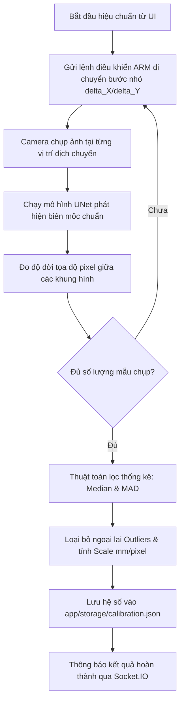

# Tính Năng Hiệu Chuẩn Kích Thước (Calibration)

## 1. Mục đích nghiệp vụ

Để các phép đo quang học (độ rộng đường hàn, khe hở, kích thước bọt khí) có giá trị vật lý chính xác theo đơn vị milimet (mm), hệ thống phải thực hiện **Hiệu chuẩn kích thước (Dimensional Calibration)**.

Quá trình này xác định hệ số quy đổi:

$$\text{Scale} = \frac{\text{Khoảng cách vật lý (mm)}}{\text{Số lượng pixel tương ứng (px)}}$$

---

## 2. Quy trình hiệu chuẩn tự động (Automatic Calibration Search)

Thay vì yêu cầu kỹ sư đo đạc thủ công bằng thước chuẩn, hệ thống trang bị thuật toán hiệu chuẩn tự động được điều phối bởi `CalibSearchCoordinator`:

---

## 3. Thuật toán xử lý và đảm bảo độ chính xác

* **Loại bỏ nhiễu cơ khí:** Việc chuyển động của cánh tay robot có thể có rung lắc hoặc độ rơ cơ khí nhỏ. Hệ thống chụp chuỗi nhiều ảnh liên tiếp theo từng bước dịch chuyển xác định.
* **Xử lý thống kê Robust (Median & MAD):**
  * Sử dụng **Trung vị (Median)** thay vì Trung bình cộng (Mean) để không bị kéo lệch bởi các khung hình rung/mờ.
  * Sử dụng **Median Absolute Deviation (MAD)** để thiết lập dải tin cậy, tự động loại bỏ các điểm ngoại lai (Outliers).
* **Lưu trữ:**
  * Thông số hiệu chuẩn được lưu trong `app/storage/calibration.json`, gắn liền với từng vị trí hoặc từng cấu hình camera.
  * Khi các Inspector thực hiện đo đạc, hệ số `mm_per_pixel` sẽ được nhân trực tiếp để quy đổi ra kích thước mm hiển thị cho người vận hành.
