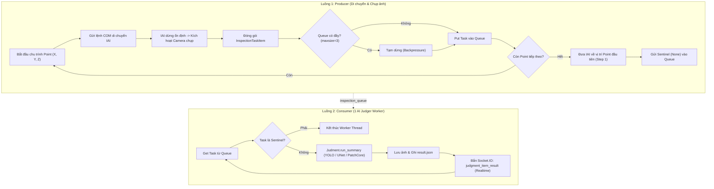

# Tính Năng Chụp Ảnh & Phán Định Tự Động (Capture & Inspection)

## 1. Mô tả tính năng

Tính năng **Chụp ảnh và Phán định tự động** là luồng kiểm tra chính của máy khi hoạt động trên dây chuyền sản xuất. Hệ thống phối hợp nhịp nhàng giữa:
1. Bộ điều khiển chuyển động cánh tay robot (IAI / ARM qua giao thức Serial).
2. Camera công nghiệp thu nhận ảnh tại các điểm dừng quy định.
3. Bộ suy luận AI và phán định thị giác máy tính.
4. Giao tiếp Socket.IO cập nhật kết quả tức thời lên màn hình công nhân và hệ thống quản lý sản xuất.

---

## 2. Chu trình kiểm tra tự động (Pipelined Producer-Consumer Architecture)

Hệ thống hoạt động theo mô hình **Hàng đợi Bất đồng bộ (Producer-Consumer Queue)** nhằm tối ưu hóa chu kỳ (Cycle Time), tách rời thời gian di chuyển cơ khí khỏi thời gian suy luận AI:

### Ưu điểm vượt trội của mô hình mới:
1. **Không phải chờ phán định xong mới di chuyển tiếp**: Trong lúc AI đang suy luận ảnh điểm $N$, IAI đã và đang di chuyển tới điểm $N+1$.
2. **Cơ chế Backpressure an toàn**: Queue tối đa 3 frame, nếu AI xử lý chưa kịp thì luồng chụp tạm dừng ngắn, đảm bảo không tràn RAM.
3. **1 Worker duy nhất**: Đảm bảo GPU VRAM không bị tranh chấp hoặc xung đột tài nguyên.
4. **Hồi vị thông minh**: Sau khi chụp xong điểm cuối, IAI lập tức quay về vị trí đầu tiên (Step 1) trong lúc worker đang xử lý nốt ảnh cuối cùng.

---

## 3. Các bước xử lý của một lần phán định (Judgment Flow)

Mỗi khi Camera chụp được một khung hình tại một Point cụ thể:

1. **Chuẩn bị đầu vào:** Frame ảnh gốc được nạp từ Camera buffer hoặc đường dẫn lưu tạm.
2. **Nạp luật Master:** `JudmentLawProductService` đọc cấu hình đã thiết lập tại `config_judgment_law.json` ứng với `Product ID -> Frame ID -> Point ID`.
3. **Thực thi mô hình AI (Inference):**
   * **UNet Detect Weld Line:** Phân đoạn mặt cắt đường hàn, tìm ranh giới đa giác.
   * **UNet Detect Film Border:** Phân đoạn tìm đường biên màng phim.
   * **YOLO Object Detection:** Định vị lỗ, linh kiện nắp che, cảm biến.
   * **YOLO Surface Segmentation:** Phát hiện bọt khí và vết xước bề mặt.
   * **PatchCore Anomaly Detection:** Trích xuất đặc trưng và so khớp với vector nhớ để phát hiện dị tật bất thường (dị vật, mẻ cạnh).
4. **Hậu xử lý & Đánh giá quy chuẩn:**
   * So khớp kích thước đo được với các mức giới hạn Master (`widthMin`, `widthMax`, `level1` - `level5`).
   * Phân loại kết quả cho điểm kiểm tra: **`OK`** (Đạt chuẩn) hoặc **`NG`** (Lỗi khuyết tật).
5. **Đồng bộ dữ liệu:**
   * Lưu ảnh kết quả (đã vẽ bounding box, đường đo, vùng lỗi) vào thư mục `app/output/`.
   * Ghi log dữ liệu kiểm tra vào file CSV và TXT (`services/log/`).
   * Bắn gói tin trạng thái và kết quả kiểm tra qua Socket.IO namespace `/log` và `/data` cho giao diện người dùng.
