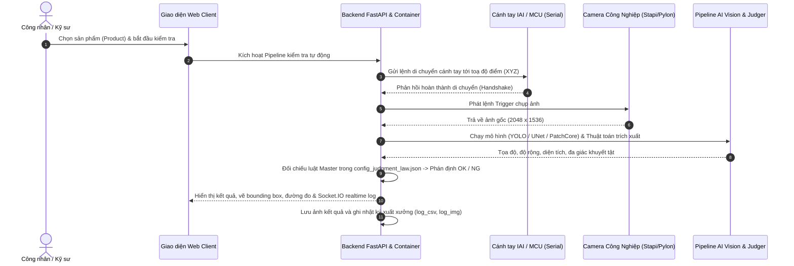

# Tổng Quan Hệ Thống Kiểm Tra Chất Lượng (Features Overview)

## 1. Mục đích hệ thống

Hệ thống **Python Detect Width Line** là giải pháp thị giác máy tính công nghiệp (Machine Vision Inspection) chuyên dụng, được triển khai trên dây chuyền sản xuất tự động nhằm:

* **Đo kích thước hình học chính xác:** Đo độ rộng mối hàn (`MeasurementWeldInspector`), khoảng cách khe hở đường hàn (`SlitWeldInspector`).
* **Kiểm tra ngoại quan và cấu trúc:** Nhận diện vị trí lỗ (`HoleItemInspector`), nắp cánh tay robot (`ArmCoverInspector`), cảm biến vị trí (`ArmSensorInspector`).
* **Phát hiện dị tật và khuyết tật bề mặt:** Phát hiện bọt khí đường hàn (`AirBubblesItemInspector`), xước ống (`ScratchedPipeItemInspector`), mẻ đầu ống (`EndChippingInspector`), dị vật bất thường (`ForeignObjectInspector`).
* **Kiểm tra màng và viền dán:** Nhận diện đường viền màng phim (`BorderFilmInspector`), màng thẩm thấu bên trong và đường viền bao ngoài (`PermeableMembraneInspector`).

---

## 2. Quy trình vận hành kiểm tra (Inspection Workflow)

---

## 3. Các chế độ hoạt động chính

### 3.1. Chế độ Vận hành Tự động (Run Inspection)
* Hệ thống tự động di chuyển robot qua toàn bộ các Frame và Point của Model đang chọn.
* Tự động chụp ảnh, xử lý inference AI và đưa ra phán định OK / NG tổng thể cho toàn bộ sản phẩm.

### 3.2. Chế độ Điều chỉnh Master (Master Adjustment)
* Dành cho kỹ sư thiết lập chuẩn mẫu cho từng loại sản phẩm.
* Cho phép vẽ và cấu hình thông số tiêu chuẩn:
  * Dung sai tối thiểu / tối đa (Min / Max width).
  * Các ngưỡng Level phán định (Level 1 -> 5).
  * Vùng kiểm tra bọt khí, dị vật, vết trầy xước.
* Quy đổi tọa độ trực tiếp giữa màn hình Canvas và toạ độ ảnh vật lý `(coordinateSpace: image)`.

### 3.3. Chế độ Hiệu chuẩn kích thước (Calibration)
* Tự động hoặc thủ công quy đổi hệ số tỷ lệ giữa pixel ảnh camera và kích thước milimet vật lý ngoài thực tế (`scaleX`, `scaleY`, mm/pixel).
* Đồng bộ độ biến dạng hoặc khoảng cách tiêu cự camera.
