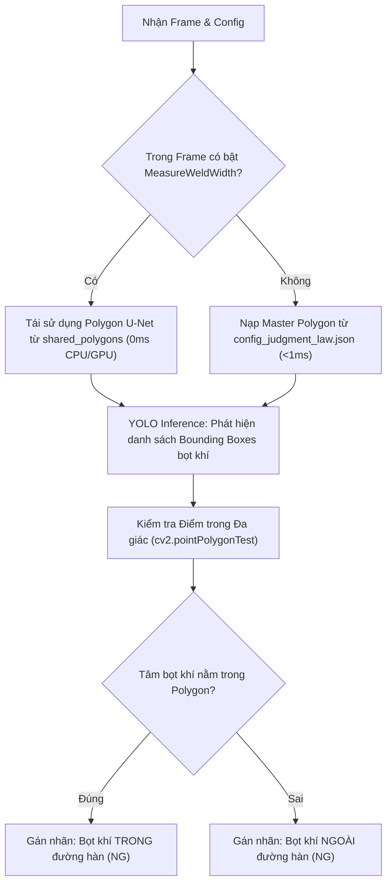

# Task: Phân biệt Bọt khí Trong / Ngoài Đường hàn (Weld Seam Air Bubble Detection)

## 1. Thông tin Nhiệm vụ
- **Mã công việc**: `TASK-CV-01`
- **Tình trạng**: Đang triển khai (In Progress)
- **Mức độ ưu tiên**: Cao (High)
- **Người phụ trách**: Senior CV Engineer
- **Tài liệu tham khảo gốc**: [`weld_bubble_detection_plan.md`](file:///c:/Disk%20D/Project/Python_Detect_Width_Line/code/app/weld_bubble_detection_plan.md)

---

## 2. Bối cảnh & Yêu cầu Nghiệp vụ

### 2.1. Thực trạng
- Hệ thống đã có mô hình U-Net (`weld_seamunet_unet_service.py`) để phân vùng đường hàn và skeletonize tìm trục tâm.
- Thuật toán `AirBubblesItemInspector` sử dụng mô hình YOLO (`object_surface_detect.pt`) để phát hiện bọt khí trên bề mặt.
- **Vấn đề cốt lõi**: Hiện tại chưa có cơ chế kiểm tra hình học xem bọt khí nằm **bên trong dải đường hàn** (lỗi công nghệ hàn) hay **nằm ngoài đường hàn** (lỗi khuyết tật phôi thép/vật liệu).

### 2.2. Tiêu chí Phán định
1. **Không có bọt khí**: Phán định **OK** (`Không phát hiện bọt khí`).
2. **Bọt khí nằm TRONG đường hàn**: Phán định **NG** (`Bọt khí nằm trong đường hàn` - Mã lỗi E-WELD-BUBBLE-IN).
3. **Bọt khí nằm NGOÀI đường hàn**: Phán định **NG** (`Bọt khí nằm ngoài đường hàn` - Mã lỗi E-WELD-BUBBLE-OUT).

---

## 3. Kiến trúc Giải pháp: Mô hình Lai (Hybrid / Shared-Polygon Architecture)



### 3.1. Thuật toán kiểm tra hình học (Point-in-Polygon)
Với mỗi bọt khí có bounding box $(x_1, y_1, x_2, y_2)$:
- Tính tâm bọt khí: $C = \left(\frac{x_1 + x_2}{2}, \frac{y_1 + y_2}{2}\right)$
- Sử dụng hàm OpenCV:
  ```python
  dist = cv2.pointPolygonTest(weld_polygon, (cx, cy), measureDist=False)
  is_inside = (dist >= 0)
  ```

---

## 4. Kế hoạch Thực hiện (Work Breakdown Structure)

- [x] **Giai đoạn 1: Phân tích & Đánh giá Kiến trúc**
  - So sánh giải pháp Template-based vs Dynamic-based vs Hybrid.
  - Hoàn thiện tài liệu thiết kế tại `weld_bubble_detection_plan.md`.
- [ ] **Giai đoạn 2: Nâng cấp Backend (`app/judger/`)**
  - Cập nhật [`WeldSeamAirBubblesDetector`](file:///c:/Disk%20D/Project/Python_Detect_Width_Line/code/app/app/judger/weld_seam_air_bubbles.py) hỗ trợ tiếp nhận `shared_polygons` và `weld_zone` từ cấu hình.
  - Triển khai logic phân loại `E-WELD-BUBBLE-IN` và `E-WELD-BUBBLE-OUT`.
- [ ] **Giai đoạn 3: Tích hợp Master Adjustment Tool trên Web UI**
  - Bổ sung nút lưu/đồng bộ biên dạng đường hàn trong `air_bubbles_tool.js`.
  - Cập nhật `air_bubbles_item_inspector.js` để gửi `weld_zone` lên `/law_regulation/save`.
- [ ] **Giai đoạn 4: Viết Unit Test & Kiểm thử Tích hợp**
  - Viết test suite tại `tests/judger/test_weld_seam_air_bubbles_detector.py`.
  - Kiểm thử hiệu năng cycle time (< 5ms khi tận dụng shared polygon).
