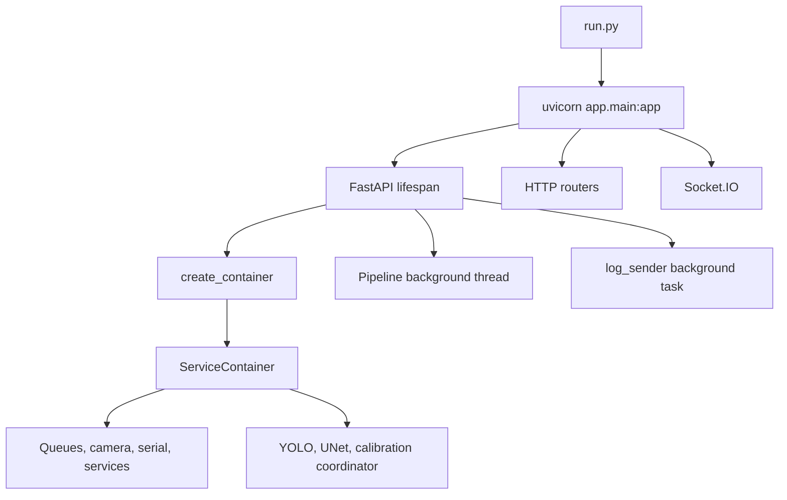
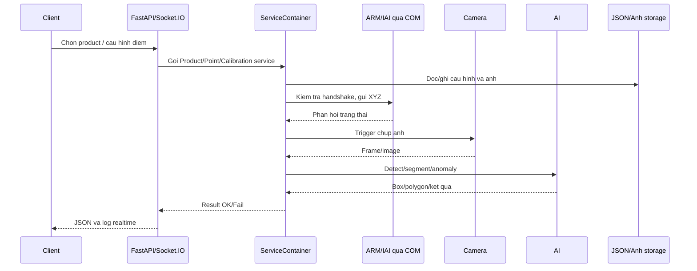

# Tong hop du an Python Detect Width Line

> Ngay tong hop: 2026-08-20
> Pham vi: toan bo source Python, cau hinh, tai lieu, test, template/static va tai nguyen runtime dang co trong workspace.

> Workspace co khoang 139 file Python. Cac file model nhi phan, virtual environment, anh, PatchCore index, TensorBoard event va artifact huan luyen duoc ghi nhan theo vai tro nhung khong doc nhu source van ban.

## 1. Muc dich du an

Day la ung dung kiem tra chat luong san pham tren day chuyen (width line), ket hop:

- FastAPI lam HTTP API va phuc vu giao dien web.
- Socket.IO de day log/du lieu theo thoi gian thuc cho client.
- Camera de chup anh tai cac diem kiem tra.
- Ket noi serial/COM voi ARM/IAI va MCU, co co che handshake, TX/RX queue.
- Calibration de anh va toa do vat ly co the quy doi/phuc vu do kich thuoc.
- AI vision de phat hien cau truc, loi be mat, vien film, mang ban tham va duong han.
- Product, point, regulation va calibration duoc luu trong cac file JSON/anh duoi `app/storage`.

Kich thuoc anh camera duoc dat mac dinh la `2048 x 1536`.

## 2. Cach chay

File `run.py` chay Uvicorn voi import `app.main:app`:

- Host: `127.0.0.1`
- Port: `8000`
- `reload=False`
- WebSocket ping interval tat (`ws_ping_interval=None`)

Lenh tuong duong:

```text
python run.py
```

Hoac dung file `run_fastapi.bat` neu moi truong Windows da duoc cau hinh.

Khi ung dung khoi dong, `app.main` tao FastAPI app, mount static/storage, dang ky router va boc app bang `socketio.ASGIApp`.

## 3. Luong khoi dong



`lifespan` thuc hien cac viec chinh:

1. Goi `create_container()` va gan container vao `fastapi_app.state.services`.
2. Tao `Pipeline` de khoi dong luong xu ly nen.
3. Tao task `log_sender` de gui log qua Socket.IO.
4. Khi shutdown hien tai moi in thong bao don dep; `Pipeline`, camera, serial, worker va task log chua co quy trinh stop day du.

`ServiceContainer` tao model va warmup ngay trong luc startup. Vi vay viec khoi dong phu thuoc vao model file, PyTorch/Ultralytics, SDK camera `stapipy` va trang thai phan cung COM. Container cung tao nhieu thread/queue co side effect, nen test hoac import truc tiep can mock hardware va model.

## 4. Kien truc module

### 4.1. `app/main.py`

Diem vao cua ung dung. Tao FastAPI, mount:

- `/static` -> `app/static`
- `/storage` -> `app/storage`

Dang ky cac nhom router: home, camera, software, product, capture product, draw regulations, calibration, COM, dimensional calibration va tool/law regulation.

### 4.2. `app/container.py`

`ServiceContainer` la composition root cua ung dung. Tai day cac dependency duoc tao va noi voi nhau:

- `IAIConfig` va `IAIService`.
- `QueueManager`, cac `Worker` va queue noi bo.
- `ManagerSerial`, `SerialConnect`, `ComRepository`, `ComService`.
- `Camera`.
- Repository/service cho point, product, choose product, calibration va judgment law.
- `Infor_Software`, `Config_SoftWare`.
- Model va service AI.
- `CalibSearchCoordinator` cho quy trinh calibration tu dong.

Container cung cap `set_mode()`/`get_mode()` co khoa `threading.Lock` de pipeline doc/ghi mode an toan hon trong moi truong nhieu luong.

### 4.3. `app/pipeline.py` va `app/stages/`

Pipeline chay trong daemon thread, lap moi 1 giay:

- `MODE_PREPOCESS`: chay `StagePreprocess` de kiem tra ket noi va dua ARM ve goc.
- `MODE_TRANSFORM`: chay `StageTransform` de lay product dang chon, gui toa do XYZ cho ARM, cho phan hoi va trigger camera chup anh.
- `MODE_EXPORT`: hien chua co xu ly trong `StageExport`.

Cac stage hien tai:

- `stage_1_preprocess.py`: xoa RX/TX queue, gui `move_to_org:`, cho `has_returned_org:`; neu thanh cong dat handshake va chuyen sang `MODE_TRANSFORM`.
- `stage_2_transform.py`: lay cac diem XYZ va duong dan retrain cua frame 0, gui lenh dang `cmd:x,y,z,80`, cho phan hoi, sau do chup anh. Khi ARM khong phan hoi, code hien goi mode `MODE_DEAFAULT` khong ton tai.
- `stage_3_export.py`: moi chi co constructor.

### 4.4. `app/config/`

- `path_config.py`: tao duong dan den storage, input model, JSON config, anh san pham, calibration va cac file model.
- `ai_config.py`: dat tham so UNet/YOLO/PatchCore, device, image size, confidence, IoU, threshold va ten class.
- `app_config.py`: kieu du lieu gui, kich thuoc anh camera.
- `queue_config.py`: ten queue va size queue.
- `iai_config.py`: cau hinh IAI.
- `calibration_config.py`: cau hinh calibration.

Cac class AI quan trong:

- `UnetConfig` va `UnetCofigAutoDetectLineMaster`.
- `YoloDetectObjectConfig`, `YoloSegmentConfig`.
- `ClassNameObjectStructureDetectConfig`: `hole`, `cover_arm`, `sensor_arm`.
- `ClassNameModelSurfaceConfig`: `air_bubble`, `scratch`.
- `PatchCoreAnomalyConfig`: index, nprobe, image size va device CPU/CUDA.

### 4.5. `app/engines/`

`engines/model_AI/` la lop bao boc model:

- `model_yolo_object.py`: YOLO object detection.
- `model_yolo_segment.py`: YOLO segmentation.
- `model_unet.py`: UNet segmentation/edge detection.
- `model_patch_core.py`: PatchCore anomaly detection.

`engines/AI_model_process/` chuyen output model thanh dang phuc vu xu ly:

- `frame_yolo_object_process.py`.
- `frame_yolo_segment_process.py`.

`engines/service/` la lop nghiep vu cho tung bai toan:

- `structure_frame_yolo_service.py`: cau truc, hole, arm cover, arm sensor.
- `surface_fram_yolo_service.py`: air bubble/scratch tren be mat.
- `boder_film_unet_service.py`: bien film.
- `permeable_membrane_yolo_service.py`: mang ban tham, phan trong va bien.
- `weld_seamunet_unet_service.py`: duong han va tim bien/polygon.
- Cac service nay duoc tao trong container va duoc router judgment goi.

### 4.6. `app/judger/`

Chua cac detector/phuong thuc phan dinh nghiep vu:

- `hole_detector.py`.
- `arm_cover_detector.py`.
- `arm_sensor_detector.py`.
- `border_detector.py`.
- `semi_permeable_membrane.py`.
- `weld_seam_air_bubbles_detector.py`.
- `scratch_the_pipe_detector.py`.

Day la tang sau AI, noi ket qua detection/segmentation voi luat phan dinh va ket qua tra ve cho client.

### 4.7. `app/services/`

Service layer hien co:

- `product_service.py`: CRUD/thao tac san pham.
- `product_choose_service.py`: san pham dang duoc chon.
- `point_service.py`: diem kiem tra, duong dan anh va toa do.
- `calibration_service.py`: doc/ghi va xu ly calibration.
- `com_service.py`: giao tiep thong qua serial manager.
- `iai_service.py`: kiem tra toa do/logic lien quan IAI.
- `judment_law_product_service.py`: luat phan dinh theo san pham.

`services/camera/`:

- `camera_connect.py`: ket noi camera va chup frame.
- `start_trigger.py`: co che trigger/chup.
- `test.py`: ma test/thuc nghiem camera.

`services/log/`:

- `log_txt.py`, `log_csv.py`, `log_img.py`: ghi log theo dang.
- `log_manager.py`: quan ly log.
- `infor_software.py`, `config_software.py`: thong tin va cau hinh phan mem.

`services/calculate_the_dimensions/` la tang cu/bo xu ly do kich thuoc va calibration, gom handler model, frame, calibration, aggregate va work detect. Mot so file co code dang comment hoac co tinh chat legacy.

### 4.8. `app/repository/`

Repository lam viec voi du lieu luu cuc bo:

- `product_repository.py`.
- `choose_product_repository.py`.
- `point_repository.py`.
- `calibration_reponsitory.py`.
- `judment_law_product_reponsitory.py`.
- `com_repository.py`.

Du lieu khong thay mot tang database quan he; thiet ke hien tai nghieng ve JSON, anh va file cau hinh trong storage.

### 4.9. `app/model/`

Cac model du lieu/noi bo:

- `product.py`, `point.py`, `line.py`.
- `calibratioin_model.py`.
- `serial.py`.
- `queue_all.py`: queue manager va worker.
- `model_AI.py`.

### 4.10. `app/core/` va `app/validate/`

- `core/dependencies.py`: FastAPI dependency lay `ServiceContainer` tu app state.
- `core/result.py`: wrapper ket qua thanh cong/that bai.
- `core/erro_code.py`: ma loi.
- `core/context.py`: context dung chung.
- `validate/validate_capture_product.py`: validate du lieu capture.
- `validate/validate_dimesional_calibration.py`: validate calibration kich thuoc.
- `validate/validate_tool_law_regulation.py`: validate payload phan dinh.

## 5. API va giao dien

### Home

`home.py` phuc vu giao dien root `/` bang Jinja2 template va co endpoint `/data_home` de lay/gui du lieu home.

### Camera

`api_config_camera.py` dang ky prefix `/camera`; hien co `/camera/status` tra ve trang thai co ban.

### Product va software

- `api_product.py`: them/sua/xoa, lay san pham va chon san pham.
- `api_config_software.py`: cau hinh/thong tin phan mem.
- `api_config_camera.py`: cau hinh/trang thai camera.

### Capture product

`api_captureproduct.py` dang ky prefix `/captureproduct`, phuc vu luong chay frame/product, xoa anh item, chay diem va cac thao tac lien quan camera + ARM.

### Calibration

- `/calibration`: capture, calculator, init data, exit.
- `/dimesional_calibration`: gui diem XYZ cho ARM, chay quy trinh calibration tu dong, exit.

Dimensional calibration su dung `IAIService` de validate vi tri, `ComService` de gui lenh va `CalibSearchCoordinator` de chay algorithm.

### Draw regulations

`api_draw_regulations.py` dang ky prefix `/draw-regulations`, co cac thao tac ve ve/quy dinh, chap nhan du lieu va thoat man hinh.

### Law regulation / judgment

`api_tool_law_regulations.py` dang ky prefix `/law_regulation`, gom:

- Measurement va tu dong tao line.
- Judgment cho arm sensor.
- Judgment cho arm cover.
- Judgment border film.
- Judgment permeable membrane.
- Judgment hole.
- Judgment scratched pipe.
- Luu law/regulation.

Luong pho bien: validate payload -> lay anh master tu PointService -> doc anh bang OpenCV -> chay AI service/detector -> quy doi box theo kich thuoc canvas -> tra `Result`.

`api_tool_law_regulations.py` hien co cac nhom judgment cho measurement, arm sensor, arm cover, border film, permeable membrane, hole va scratched pipe. Cac endpoint nay ket noi truc tiep toi service AI va detector trong `app/judger/`.

### Socket.IO

`socketio_log.py` tao namespace `/log` va `/data`, doc queue log/data va emit trang thai camera, COM, capture, calibration va ket qua calibration. Cau hinh `cors_allowed_origins="*"` dang cho phep moi origin.

### COM va Socket.IO

- `api_com.py` dang ky `/com`; mot so endpoint hien la khung chua hoan thien.
- `socketio_log.py` tao `sio` va task gui log queue den client.

## 6. Luong nghiep vu chinh



Pipeline tu dong hien thuc hien handshake ve goc truoc, sau do di qua cac diem cua product dang chon, chup anh tai moi diem. Phan AI va phan dinh co the duoc goi qua cac API judgment; stage export chua duoc trien khai day du.

## 7.1. Data flow cua mot lan kiem tra

```text
Payload API
    -> validate
    -> PointService lay anh master/path/model
    -> OpenCV doc va crop ROI
    -> YOLO/UNet/PatchCore infer
    -> detector loc ket qua va quy doi toa do
    -> Result.Ok/Fail
    -> HTTP response va Socket.IO log
```

Calibration tu dong di theo luong: API nhan cau hinh -> `CalibSearchCoordinator` dieu khien ARM -> camera chup nhieu anh -> worker chay UNet -> `CalibrationService` tinh median/MAD, loc outlier va scale mm/pixel -> ghi JSON va gui log realtime.

## 7. Tai nguyen model va du lieu

### Model/du lieu trong workspace

- `app/input/model/`: model runtime duoc `path_config.py` tham chieu, gom UNet, YOLO va PatchCore.
- `model_air_bubble/`: du lieu/model lien quan air bubble.
- `model_patch_core/`: `patchcore_ivf.index`, `patchcore_memory.npy`.
- `unet_test_model_vien/`: model UNet test.
- `train17`, `train18`, `train38`, `train42`: artifact huan luyen, `args.yaml`, `results.csv`, `weights` va TensorBoard event.
- `model_air_bubble/train16`: artifact huan luyen khac.
- `app/storage/`: anh san pham, anh ROI, JSON san pham, point, calibration, regulation, config COM/IAI va log khi chay.
- `app/static/`, `app/templates/`: tai nguyen giao dien.

Model binaries, anh va virtual environment khong duoc doc nhu van ban trong ban tong hop nay; chi ghi nhan duong dan va vai tro cua chung.

## 8. Test hien co

Workspace co cac nhom test cho:

- Product service, choose product, point service.
- Calibration.
- Serial connect va serial manager.
- IAI service.
- Model YOLO object/segment, UNet, PatchCore.
- Frame AI model process.
- Structure/surface judgment detector.
- Camera va cac ham crop/xu ly anh.
- Calibration search coordinator.

Test dang nam trong `app/tests/`. Can kiem tra lai fixture, hardware dependency, duong dan local va model file truoc khi chay full suite.

Mot so file la script thu nghiem co `main()` hon la unit test pytest chuan. Chua thay bo fixture/mock hardware co he thong; mot so test import symbol/module khong con dong bo, dung duong dan tuyet doi hoac can model/anh ngoai workspace. Chua co integration test ro rang cho FastAPI lifespan va toan bo API.

## 9. Phu thuoc ky thuat quan sat duoc

`requirements.txt` la nguon phu thuoc cua du an. Ma nguon cho thay cac nhom thu vien chinh sau:

- FastAPI, Uvicorn, Socket.IO.
- OpenCV.
- PyTorch va cac thu vien model/vision.
- NumPy va xu ly anh.
- Serial/COM.
- Pydantic/Jinja2.

Du an kem mot thu muc `venv-project-width-line`; khong nen coi virtualenv nay la source code hoac dua vao version control.

`requirements.txt` dang dung encoding UTF-16/BOM, do do can doc bang encoding phu hop khi kiem tra danh sach dependency day du.

## 10. Diem can chu y va rui ro ky thuat

1. `StageTransform.run()` goi `EnumMode.MODE_DEAFAULT`, nhung `EnumMode` chi khai bao `MODE_PREPOCESS`, `MODE_TRANSFORM`, `MODE_EXPORT`. Nhanh loi nay se gay `AttributeError` khi ARM khong phan hoi.
2. `StagePreprocess.check_protocol_connect_com()` cho vong lap cho phan hoi ma khong thay timeout ro rang, nen pipeline co the bi block neu COM khong phan hoi.
3. `Pipeline._run_pipeline()` la vong lap vo han; `stop_task_pipeline()` chi dat co, nhung vong lap khong ngu/ngat theo co khi da dung va khong duoc goi trong lifespan shutdown.
4. `StageExport` chua co logic.
5. Mot so endpoint, dac biet trong `api_com.py`, con `pass` hoac chi la skeleton.
6. `ServiceContainer` load nhieu model ngay luc khoi dong, co the ton bo nho va lam cham startup; cau hinh mac dinh cua YOLO la CPU neu khong doi.
7. `main.py` dung duong dan tuong doi cho `app/static`, `app/storage`, `app/templates`; chay tu thu muc goc la dieu kien quan trong.
8. `api_calibration.py` co duong dan anh test cung hard-code theo may phat trien; can thay bang config/storage khi dua vao moi truong khac.
9. `routers.__all__` co dau hieu khong dong bo: tham chieu `socket_log` khong duoc import va thieu dau phay giua hai ten cuoi. Import truc tiep trong `main.py` van dang dung cac symbol rieng, nhung `from app.routers import *` co the loi.
10. Ten file va ten symbol co nhieu typo/khong dong nhat (`dimesional`, `reponsitory`, `judment`, `MODE_PREPOCESS`). Chua can doi ten neu khong co ke hoach migration vi co the pha import.
11. Quan ly queue, camera, COM va browser thread co nhieu side effect khi import/khoi tao; test don vi nen mock hardware va model.
12. Quy trinh shutdown moi chi in log, chua dong camera, serial, worker, thread pipeline va task Socket.IO mot cach tuong minh.
13. `api_captureproduct.py` dung `EnumMode.MODE_RUN_ONE_FRAME`, nhung enum hien tai khong khai bao mode nay; endpoint `/captureproduct/run_frame` co the loi truoc khi tra ve response placeholder.
14. `api_calibration.py` tham chieu `services.obj_cv2`, `services.obj_logic` va `services.obj_calibration`, nhung `ServiceContainer` hien tai khong khoi tao cac thuoc tinh nay. Container chi co `obj_service_calibration` va `obj_unet_calib_search_coordinator`; endpoint calibration co the loi khi duoc goi.
15. `api_draw_regulations.py` tham chieu `services.obj_logic`, trong khi container khong khoi tao `Logic`; endpoint `accept_data` co the loi khi duoc goi. Cac method ProductService ma router su dung can duoc kiem tra them khi chay endpoint.
16. `StageTransform` lay `result_path` tu frame 0 nhung dung trong vong lap cho nhieu frame, co nguy co dung sai duong dan retrain.
17. Calibration coordinator va mot so handler/test con hard-code duong dan nhu `C:\Users\anhuv\Desktop\test_tool\...` va `C:\Users\anhuv\Desktop\train\...`.
18. Trong calibration coordinator, mot so trang thai camera/COM bi gan cung thanh `True`, co the che mat loi phan cung thuc te. Thread calibration duoc tao non-daemon co the giu process chua thoat khi shutdown.

## 11. Trang thai tong quat

### Da co khung va dang duoc su dung


### Dang phat trien/chua hoan tat


## 12. Thu tu nen doc khi tiep tuc phat trien

1. `run.py` -> `app/main.py` de nam entrypoint.
2. `app/container.py` de nam dependency va side effect startup.
3. `app/pipeline.py` -> `app/stages/` de nam luong tu dong.
4. `app/routers/` de nam contract voi frontend/client.
5. `app/services/` -> `app/repository/` -> `app/model/` de nam luong du lieu.
6. `app/engines/` -> `app/judger/` de nam AI va phan dinh.
7. `app/config/`, `app/storage/`, `app/input/model/` de doi chieu cau hinh/runtime.
8. `app/tests/` de kiem tra hanh vi va phat hien phu thuoc hardware/model.

## 13. Ket luan

Du an la mot he thong inspection cong nghiep ket hop dieu khien co khi va computer vision. Kien truc hien tai da tach kha ro router, service, repository, model va engine, nhung `ServiceContainer` van dang om phan lon viec khoi tao va side effect. Trong ngan han, uu tien nen la sua loi mode fallback, them timeout/shutdown cho pipeline va hardware, bo sung test mock cho COM/camera, sau do moi hoan thien export va chuan hoa cau hinh duong dan.

Ban tong hop nay duoc cap nhat sau khi quet toan bo workspace vao ngay 2026-08-20. Chua chay full application/test suite vi viec nay co the khoi tao camera, COM va model AI that; cac nhan dinh ve runtime can duoc xac nhan them bang test co mock hoac moi truong hardware phu hop.

## 14. Thay doi gan day va diem bat dau cho section moi

Day la muc doc nhanh cho cac thay doi sau ngay 2026-08-20.

### 14.1. Camera configuration

- `app/config/camera_config.py`: `CameraConfig`, validation va parser doc truc tiep file GenApi `features.cfg`.
- `app/services/camera/camera_connect.py`: doc, apply, save, reset va rollback camera feature.
- `app/routers/api_config_camera.py`: API web camera.
- `app/templates/home.html`: panel `#paner-camera-config`.
- `app/static/css/camera_config_panel.css`: CSS panel camera.
- `app/static/js/camera_config_panel.js`: load config, Stream Video, Accept, Save, Thoat va console log.
- Nguon cau hinh duy nhat: `app/storage/features.cfg`; khong dung `config_camera.json`.

Cac gia tri co selector trong `features.cfg` phai doc dung context:

- `AcquisitionFrameRate`: dong khong selector, hien tai `98.2376`.
- `ExposureTime`: dong `ExposureTimeSelector=Common`, hien tai `9998.78`.
- `Gain`: dong `GainSelector=AnalogAll`, hien tai `100`.
- `BlackLevel`: dong `BlackLevelSelector=AnalogAll`.
- `BalanceRatio`: doc rieng Red/Green/Blue theo `BalanceRatioSelector` (`229/128/272`).
- `TriggerMode`: doc dong `TriggerSelector=FrameStart`.

API camera:

- `GET /camera/status`
- `GET /camera/config`
- `POST /camera/config/apply`: apply tam thoi, khong ghi feature file.
- `POST /camera/config/save`: apply va ghi nodemap bang `FeatureBag.store_nodemap_to_bag()` + `save_to_file()`.
- `POST /camera/config/reset`: nap lai `features.cfg`.
- `GET /camera/exit`: tra `redirect_url` ve `/`.

Neu Apply/Save that bai, camera config runtime va file feature duoc rollback ve trang thai truoc do. `CameraConfig.OPERATOR_FIELDS` khong cho operator sua white balance calibration.

### 14.2. Camera panel frontend

Panel camera nam trong `.show-option`, dung `openOptionPanel()` tu `app/static/js/panel_manager.js` de dong panel khac. `Stream Video` dung cung luong `active_sceen_show_video()` + `show_video_product()` voi dimensional calibration. White Balance Auto la custom button: `Off` khoa Red/Green/Blue, `On` mo ba input. Console log dung prefix `[CameraConfig]`.

### 14.3. COM configuration

- `app/config/com_config.py`: `ComConfig`, validation va chuyen doi voi `SerialConfig`.
- `app/services/com_service.py`: list port, configure connection va rollback khi mo cong that bai.
- `app/routers/api_com.py`: `GET /com/config`, `POST /com/config`.
- `app/templates/home.html`: overlay `#overlay_config_com`.
- `app/static/css/config_com.css`: giao dien overlay dark phong cach panel chon san pham.
- `app/static/js/config_com.js`: load danh sach cong, render, submit va dong overlay.
- `app/storage/config/COM.json`: cau hinh duoc luu de lan chay sau.

`SerialConnect` doc `COM.json` khi khoi tao; `ManagerSerial` tu kiem tra va mo lai cong da luu. `ComService` dung `ManagerSerial.update_com()` de dong cong cu, mo cong moi, luu config va khoi dong lai RX/TX.

### 14.4. Product header va panel switching

`app/routers/home.py` lay product dang chon, tra ten qua `ProductService` va truyen `selected_product_name`. `app/templates/home.html` hien thi `#current-product-text` ben phai header; CSS nam trong `app/static/css/home.css`, font 14px va ellipsis cho ten dai.

`app/static/js/panel_manager.js` xoa `active` tren cac `.show-option > .paner` truoc khi them `active` cho panel moi. Cac luong capture, dimensional calibration, adjustment master va camera config deu dung helper nay. Tranh gan `transform`, `opacity`, `z-index` inline vi co the lam panel cu tiep tuc che panel moi.

### 14.5. Thu tu doc nhanh cho section moi

1. Doc `app/container.py` de biet service va side effect startup.
2. Doc router lien quan de biet endpoint/dependency.
3. Doc service de biet nghiep vu va hardware operation.
4. Doc config/repository de biet nguon du lieu luu tru.
5. Doc template + JS + CSS de biet ID/class giao dien.
6. Chay `venv-project-width-line\Scripts\python.exe -m py_compile` va focused test/harness.

Trang thai da xac nhan:

- SDK StApi co `FeatureBag.store_nodemap_to_bag`, `save_to_file`, `store_file_to_bag`, `load`.
- Parser `features.cfg` da tra dung cac gia tri camera selector-aware.
- Camera config rollback va COM config separation da duoc kiem tra bang runtime harness.
- Cac file lien quan da compile va diagnostics khong bao loi tai thoi diem cap nhat.

Rui ro con lai:

- Chua co integration test voi camera/COM that.

## 18. Cap nhat ngay 2026-08-28

### 18.1. Tach output runtime

- Da tach thu muc runtime `app/storage/retrain` thanh `app/output/patch_core`, nam cung cap voi `app/core` va `app/storage`.
- `app/config/path_config.py` co `BASE_PATH_OUTPUT` va `PATH_FOLDER_IMG_COORDINATE_OUTPUT`.
- `PointService` da dung path output moi cho anh PatchCore runtime.
- `app/storage/points.json` da cap nhat `path_img_retrain` sang `output\\patch_core`.
- `output/` da duoc them vao `.gitignore`.

### 18.2. Sua loi startup va WebSocket

- `PointRepository.load_points()` da doc JSON bang `utf-8-sig`, xu ly duoc `points.json` co UTF-8 BOM.
- Da kiem tra `PointRepository`, `PointService` va import `app.main` thanh cong.
- Camera WebSocket trong `app/routers/api_captureproduct.py` da bat `WebSocketDisconnect`, `ConnectionResetError` va `BrokenPipeError` dung cach.
- Da sua loi dung bien exception `e` chua duoc bind trong handler WebSocket.
- `app/main.py` co exception handler loc rieng `WinError 10054` cua Windows Proactor, khong anh huong cac loi khac.

### 18.3. BorderDetector va phan dinh theo mm

- `BorderDetector` da goi UNet mot lan cho moi anh, sau do tai su dung polygon cho tat ca line.
- Giao diem `p1`, `p2` duoc lay bang Shapely `LineString.intersection()` thay vi lay pixel dau/cuoi tu mask.
- `compare()` nhan `scale_mm_per_pixel` tu caller.
- Khoang cach duoc tinh bang `distance_mm = distance_pixel * scale_mm_per_pixel`.
- Luat phan dinh la `widthMin <= distance_mm <= widthMax` thi `OK`, nguoc lai `NG`.
- `widthMin` va `widthMax` duoc xem la don vi mm, khong nhan scale khi luu master.
- API border da duoc noi vao luong `define -> compare -> judge`, lay calibration theo frame va tra ket qua tung line.
- Ket qua API border gom `distance_pixel`, `distance_mm`, gioi han min/max va `is_valid`.
- Test runtime border da ve polygon, line, doan giao, p1/p2, khoang cach va nhan `OK/NG` tung line.

### 18.4. Luu master va quy doi toa do

- Client luu master gui them `WidthCanvas` va `HeightCanvas` trong `summary_tool.js`.
- API luu master lay kich thuoc anh master that theo tung point.
- Toa do line duoc chuyen tu canvas web sang pixel anh master truoc khi luu.
- `widthMin` va `widthMax` duoc giu nguyen theo mm.
- Du lieu da chuyen duoc danh dau bang `coordinateSpace: image`.
- API bo qua quy doi neu line da o he toa do `image`, tranh bi nhan scale nhieu lan khi Save.
- Client chuyen nguoc toa do image ve canvas khi nap lai master de hien thi dung tren giao dien.
- Log Save master da hien thi ca qua trinh thanh cong, that bai, quy doi toa do va loi ket noi.

### 18.5. Chuan hoa judger va inspector name

- `BaseJudgerAI` da co contract `INSPECTOR_NAME` va kiem tra moi class con phai khai bao ten rieng.
- Mapping hien tai:
    - `ArmSensorInspector` -> `ArmSensorDetector`.
    - `ArmCoverInspector` -> `ArmCoverDetector`.
    - `BorderFilmInspector` -> `BorderDetector`.
    - `HoleItemInspector` -> `HoleDetector`.
    - `MembraneInspector` -> `SemiPermeableMembrane`.
    - `ScratchedPipeItemInspector` -> `ScratchThePipeDetector`.
    - `AirBubblesItemInspector` -> `WeldSeamAirBubbles`.
- `InspectorName` duoc tach rieng khoi label model AI; khong dung ten inspector lam label model.
- JavaScript `ArmCoverItemInspector.NAME` da duoc doi tu `CoverSensorInspector` thanh `ArmCoverInspector` va dong bo voi JSON.

### 18.6. Scratch va Air Bubble

- `ScratchThePipeDetector` su dung luat phu dinh: co Scratch -> `NG`, khong co Scratch -> `OK`.
- `WeldSeamAirBubbles` da hoan thien: co `air_bubble` -> `NG`, khong co -> `OK`.
- Hai detector deu co `define`, `compare`, `judge` va tra `JudgmentResult`.
- Da tao test logic va runtime cho Scratch, Air Bubble; test runtime Air Bubble da phat hien 6 object tren anh kiem tra va tra `NG` dung luat.

### 18.7. Cau truc test moi

- Test duoc sap xep lai thanh:
    - `app/tests/test_judment/logic/`
    - `app/tests/test_judment/runtime/`
- `logic/` chua test Mock cho Cover, Sensor, Hole, Border, Scratch, Semi-permeable membrane va Air Bubble.
- `runtime/` chua test model that cho Cover, Sensor, Hole, Border, Scratch, Semi-permeable membrane va Air Bubble.
- Da sua `PROJECT_ROOT`, import package va duong dan anh/model sau khi them hai tang `logic` va `runtime`.
- Toan bo test logic hien tai da chay PASS; cac test runtime da duoc chuan hoa de dung model/path trong workspace.

### 18.8. Kiem tra da thuc hien

- `py_compile` cho cac file backend, judger va test lien quan: PASS.
- Test logic BorderDetector: PASS 5 test.
- Test logic WeldSeamAirBubbles: PASS 5 test.
- Test logic cac judger khac: PASS.
- Test runtime BorderDetector voi UNet that: PASS, co giao diem chinh xac va phan dinh theo mm.
- Test runtime WeldSeamAirBubbles voi model that: PASS, phat hien bot khi va tra `NG`.
- Kiem tra mapping `InspectorName`: PASS.
- Kiem tra quy doi toa do va Save lap lai: PASS.
- Ten node GenApi phu thuoc model camera Sentech.
- Khong nen sua thu cong `features.cfg` trong production; nen luu qua SDK.
- Full app startup khoi tao model, camera, COM va thread; test router nen dung service fake.

## 15. Cap nhat da xac nhan ngay 2026-08-24

### 15.1. Pipeline va startup

- `EnumMode` hien chi co `MODE_PREPOCESS`, `MODE_TRANSFORM` va `MODE_EXPORT`; chua co `MODE_IDLE` hay `MODE_RUN_ONE_FRAME`.
- Sau khi `StagePreprocess` gui `move_to_org:` va nhan `has_returned_org:`, pipeline dat mode `MODE_TRANSFORM`, vi vay co the tu dong chay qua cac point sau khi homing.
- `StageTransform` hien dung `Logic.wait_for_specific_data()`, lay duong dan retrain mot lan cho frame 0, xu ly cac point va khong dat `MODE_EXPORT` sau khi ket thuc.
- Nhanh loi khi ARM khong phan hoi van goi `MODE_DEAFAULT`, la ten mode khong ton tai; endpoint `/captureproduct/run_frame` cung goi mode khong ton tai va hien tra response placeholder.
- Shutdown Pipeline/hardware chua day du.

### 15.2. COM

- Luong COM: `ComConfig` -> `ComRepository` -> `SerialConnect` -> `ManagerSerial` -> `ComService` -> API `/com/config`.
- Cau hinh hien tai duoc doc tu `app/storage/config/COM.json`; workspace da kiem tra voi `COM3`, baudrate `9600`.
- `ManagerSerial` co cac thread `CheckCOM`, `SerialRX`, `SerialTX`, cung `rx_queue` va `tx_queue`.
- `POST /com/config` da tra ve ca `success`, `message`, `config`, `connected` va `ports`, ke ca khi mo cong that bai; frontend khong con mat danh sach cong sau khi luu.
- `ComService.configure_connection()` rollback cau hinh JSON neu mo cong moi that bai.
- `shake_hands_compelete` la trang thai handshake ARM, khac voi trang thai cong serial vat ly dang mo. Can tach hai trang thai neu muon hien thi chinh xac hon.

### 15.3. Calibration va Draw Regulations

- `ServiceContainer` hien tao `obj_service_calibration` (`CalibrationService`) va `obj_unet_calib_search_coordinator` (`CalibSearchCoordinator`), khong tao `obj_calibration`.
- `api_calibration.py` dang dung them `services.obj_cv2` va `services.obj_logic`, nhung hai dependency nay chua duoc gan trong container. Router cung con doc anh test tu duong dan tuyet doi tren may phat trien thay vi dung frame vua chup.
- `api_draw_regulations.py` dang dung `services.obj_logic`, nhung dependency nay chua duoc gan trong container. Day la endpoint chua dong bo voi composition root hien tai.

### 15.4. Frontend va canvas

- `controler.js` import cac module frontend; `home.js` phu trach man hinh chinh, `capture_frame.js` phu trach Lay anh mau, `dimetional_calibration.js` phu trach hieu chuan kich thuoc, `tool/summary_tool.js` phu trach Dieu chinh Master.
- Cac man hinh dung chung `.scroll-container`, nen item cu co the con ton tai khi doi panel. Handler item trong `summary_tool.js` chi `stopPropagation()` khi panel Dieu chinh Master dang active; khi o man hinh chinh, click duoc xu ly boi `home.js` va hien anh tren canvas.
- Khi vao Dieu chinh Master, click item khong tu hien anh; sau khi chon tool, anh item duoc hien qua `showSelectedImage()`.
- `video-product` duoc an ban dau de khong hien alt text `Video feed`; chi nut `Stream Video` moi bat video.
- Loi `coordinate_items_now` giu `-1` tung do click nham item do `summary_tool.js` tao hoac dung bien `coordinates` truoc khi khai bao; handler dimensional da duoc sua de cap nhat toa do theo item.

### 15.5. AI va detector trong judger

- `object_structure_detect.pt` dung chung cho `hole`, `cover_arm`, `sensor_arm`.
- `object_surface_detect.pt` dung cho `scratch`.
- Cac router production dang dung `StructureFrameYoloService` va `SurfaceFrameYoloService`; cac detector trong `app/judger` phan lon la lop logic cu/test-oriented.
- `ClassNameObjectTargerDetectConfig` khong ton tai; ten hien tai la `ClassNameObjectStructureDetectConfig`. Scratch dung `ClassNameModelSurfaceConfig.SCRATCH`.
- `BaseJudgerAI` trong `app/judger/base_ai.py` la abstract contract bat buoc cac lop con co `define`, `compare`, `judge`; co them `evaluate()` de goi theo thu tu `define -> compare -> judge`.
- `JudgmentResult` tra ve `ok`, `status`, `standard_data`, `runtime_data`, `comparison_data`, `message`, `errors`.
- `ArmCoverDetector.compare()` nhan `standard_data` bool: `True` nghia la ROI phai co Cover Arm, `False` nghia la ROI khong duoc co Cover Arm. `runtime_data` la output tuple cua `define()`: `(status, messages, image, objects)`.
- Script model that `app/tests/test_run_armcoverdetector.py` khong dung Mock; script load weights that, doc anh, chay `define`, `compare`, `judge` va in log. Anh da kiem tra `app/storage/img_points/1/0/4.jpg`, ROI `0,0,2016,619` phat hien `sensor_arm` confidence khoang `0.983`, khong phat hien `cover_arm`, nen `standard_data=True` cho ket qua `NG` la dung.
- Script test thuong `test_armcoverdetector.py` dung Mock de test orchestration, khong phai test model accuracy. Pytest chua duoc cai trong virtualenv.

### 15.6. Quy uoc tiep tuc phat trien

1. Khi test logic detector, dung script thuong voi Mock neu khong can model that.
2. Khi kiem tra model, dung `test_run_armcoverdetector.py`, sua cac hang `MODEL_PATH`, `IMAGE_PATH`, `STANDARD_DATA`, `X1`, `Y1`, `X2`, `Y2` o dau file.
3. Chay compile bang `venv-project-width-line\\Scripts\\python.exe -m py_compile <files>`.
4. Khong chay full app/test suite tuy tien vi startup khoi tao camera, COM, model va thread.

## 16. Cap nhat detector structure va test ngay 2026-08-25

### 16.1. Arm Sensor va Hole

- `app/judger/arm_sensor_detector.py` da hoan thien theo contract cua `BaseJudgerAI`:
    `define() -> compare() -> judge()`.
- `ArmSensorDetector.define()` goi `FrameModelYoloObject.search()` voi class `sensor_arm` va tra runtime tuple gom `(status, messages, image, objects)`.
- `compare()` kiem tra `standard_data` la bool, xac dinh `runtime_exists` va dem so object.
- `judge()` tra `JudgmentResult` voi trang thai `OK`/`NG` tuy theo Sensor Arm co dung voi cau hinh hay khong.
- `app/judger/hole_detector.py` da duoc hoan thien tuong tu, su dung class `hole`.
- Test logic:
    - `app/tests/test_logic_armsensor.py`
    - `app/tests/test_logic_hole.py`
- Moi bo test logic gom 5 truong hop va da PASS bang model Mock.
- Test model that:
    - `app/tests/test_run_armsensor.py`
    - `app/tests/test_run_hole.py`
- Anh `app/storage/img_points/1/0/4.jpg` da duoc dung de kiem tra model structure. Model phat hien `sensor_arm` voi confidence khoang `0.977`; khong phat hien `hole`, vi vay Hole voi `standard_data=True` cho ket qua `NG` la dung.

### 16.2. Semi-permeable membrane

- `app/judger/semi_permeable_membrane.py` da hoan thien `compare()` va `judge()`.
- Luat co dinh: polygon `inner` phai nam hoan toan ben trong polygon `border`.
- `inner` de len bien, cat bien, nam ngoai hoac thieu mot trong hai polygon deu la `NG`.
- Kiem tra hinh hoc van dung `shapely.geometry.Polygon.contains()` trong ham logic da co san.
- `define()` tra `(status, intersection_points, image_visualized)`; `compare()` va `judge()` chuyen ket qua nay thanh `JudgmentResult`.
- Test logic: `app/tests/test_logic_semi_permeable_membrane.py` da PASS 5 truong hop, gom ca inner nam trong, de len border, nam ngoai va thieu polygon.
- Test runtime: `app/tests/test_semi_permeable_membrane_judment.py` da duoc cap nhat dung path model/anh trong workspace va kiem tra ca `define()`, `compare()`, `judge()`.
- Test runtime da load duoc hai model segmentation that. Ket qua phu thuoc anh; neu khong tao duoc polygon hop le thi phai tra `NG`, khong duoc coi la `OK`.

### 16.3. Scratch The Pipe

- `app/judger/scratch_the_pipe_detector.py` da hoan thien theo luat phu dinh:
    phat hien Scratch -> `NG`, khong phat hien Scratch -> `OK`.
- `define()` su dung `FrameModelYoloObject.search_negative()` voi class `scratch`.
- `compare()` va `judge()` xu ly `runtime_clean`: `True` la vung sach, `False` la co Scratch.
- Test logic: `app/tests/test_logic_scratch_the_pipe.py` da PASS 4 truong hop.
- Test runtime: `app/tests/test_run_scratch_the_pipe.py` da load model `object_surface_detect.pt` va anh that. Anh da kiem tra phat hien 1 object `scratch`, do do ket qua `NG` la dung.
- Trong `app/engines/AI_model_process/frame_yolo_object_process.py`, `search_negative()` da unpack dung ket qua `get_objects()` theo dang `(all_objects, image_crop)`.

### 16.4. Hien thi anh OpenCV

- `FrameModelYoloObject.show()` da ho tro ca anh da ve san va anh kem danh sach object.
- Ham hien thi tao cua so co the resize, tu dong thu nho anh lon va cho phep nhan phim de ket thuc.
- `test_run_scratch_the_pipe.py` hien goi `frame_model.show(image_result, window_name="Scratch The Pipe Result")` sau khi phan dinh.
- Cleanup cua `show()` va `show_image()` da xu ly `cv2.error` khi cua so chua duoc tao hoac da bi dong, tranh loi thu cap tu `destroyWindow()`.
- Neu moi truong khong co GUI, OpenCV van khong the mo cua so; khi do can luu `image_result` ra file hoac chay test trong phien Windows co desktop.

### 16.5. Kiem tra da thuc hien

- Da chay `py_compile` cho cac detector va test lien quan.
- Test logic Arm Sensor: PASS.
- Test runtime Arm Sensor voi model that: PASS, ket qua OK tren anh da kiem tra.
- Test logic Hole: PASS.
- Test runtime Hole voi model that: PASS, ket qua NG do anh khong co Hole.
- Test logic Semi-permeable membrane: PASS.
- Test runtime Semi-permeable membrane: model load thanh cong; ket qua `OK` hoac `NG` tuy polygon model phat hien duoc.
- Test logic Scratch: PASS.
- Test runtime Scratch voi model that: PASS, phat hien 1 Scratch va tra `NG`.

## 19. Kiem tra doi chieu source - 2026-09-03

- Da doi chieu truc tiep `app/container.py`, `app/pipeline.py`, cac stage pipeline va cac router calibration, capture product, draw regulations voi noi dung tai lieu.
- Trang thai mode thuc te chi gom `MODE_PREPOCESS`, `MODE_TRANSFORM` va `MODE_EXPORT`; `MODE_IDLE` va `MODE_RUN_ONE_FRAME` chua ton tai.
- `StagePreprocess` hien chuyen sang `MODE_TRANSFORM` sau khi ARM bao da ve goc, khong chuyen sang `MODE_IDLE`.
- `StageTransform` van lay path retrain cho frame 0, dung `Logic.wait_for_specific_data()` va chua chuyen mode sang export sau khi ket thuc.
- `StageTransform` con loi tham chieu `MODE_DEAFAULT`; `/captureproduct/run_frame` con loi tham chieu `MODE_RUN_ONE_FRAME` va tra response mau.
- `ServiceContainer` chua gan `obj_cv2`, `obj_logic` va `obj_calibration`; cac router calibration/draw regulations su dung cac thuoc tinh nay nen chua dong bo voi composition root.
- `api_calibration.py` con doc anh tu duong dan tuyet doi tren may phat trien; day la code test/placeholder, khong phai luong production hoan chinh.
- Chua sua code Python trong dot doi chieu nay; cac diem tren duoc ghi ro de lam co so cho lan sua tiep theo.

## 17. Tach output runtime khoi storage - 2026-08-28

- Thu muc runtime truoc day `app/storage/retrain` da duoc di chuyen thanh `app/output/patch_core`.
- `app/output` nam cung cap voi `app/core` va `app/storage`, dung de tach anh/output runtime khoi du lieu cau hinh, master va anh diem trong storage.
- `app/config/path_config.py` co `BASE_PATH_OUTPUT` va `PATH_FOLDER_IMG_COORDINATE_OUTPUT` tro den `app/output/patch_core`.
- `PointService` da dung path output moi khi tao, doc va xoa thu muc anh PatchCore runtime.
- Alias `PATH_FOLDER_IMG_COORDINATE_PRODUCT_RETRAIN` van duoc giu tam thoi de tuong thich voi test/module cu; gia tri alias da tro den output moi, khong con tro vao storage.
- Cac path `path_img_retrain` da luu trong `app/storage/points.json` duoc cap nhat tu `storage\\retrain\\patch_core` sang `output\\patch_core`.
- `app/output/` da duoc them vao `.gitignore` vi day la du lieu runtime, khong nen commit cung source.

## 20. Ghi chu ban giao phien lam viec - 2026-09-03

### 20.1. Judment va registry detector

- `app/judger/judment.py` co `Judment.run()` va `Judment.run_summary()`; cac inspector duoc chay tuan tu theo thu tu `define -> compare -> judge`.
- `run_summary()` tiep tuc chay tool sau neu mot tool bi exception, ghi tool loi thanh `NG`, va tra output tong gom `overall`, `status`, `message`, `image`, `processed_at`, `inspectors`, `errors`.
- Log bat dau/ket thuc tung inspector duoc in trong `Judment`; mang NumPy duoc rut gon thanh shape/dtype khi log.
- `app/container.py` da co registry: `MeasurementWeldInspector`, `SlitWeldInspector`, `ArmSensorInspector`, `ArmCoverInspector`, `BorderFilmInspector`, `MembraneInspector`, `HoleItemInspector`, `ScratchedPipeItemInspector`, `AirBubblesItemInspector`.
- `EndChippingInspector` chua co detector Python ke thua `BaseJudgerAI`, nen test runtime hien bo qua va in thong bao skipped.
- Alias `Judgment = Judment` da bi xoa khoi `judment.py`; `app/judger/__init__.py` cung da xoa import alias nay. Ten chinh thuc hien tai la `Judment`.

### 20.2. Toa do canvas va anh output

- API `/law_regulation/save` goi `convert_canvas_coordinates()` trong `app/services/judment_law_product_service.py` de chuyen toa do canvas sang toa do anh that truoc khi luu.
- Conversion ap dung cho moi inspector co `xStart`, `yStart`, `xEnd`, `yEnd`; du lieu da co `coordinateSpace: image` duoc bo qua de tranh scale hai lan.
- `summary_tool.js` chuyen nguoc image coordinates ve canvas khi load master; `widthMin`/`widthMax` giu nguyen vi la don vi mm.
- `BorderDetector`, `MeasurementWeldingDetector` va `SlitDetector` tra anh output co polygon, line va giao diem.
- `FrameModelYoloObject.search()` va `search_negative()` tra anh co ROI; da comment lệnh hien thi anh trong model.
- Hien thi anh sau phan dinh nam o test runtime, khong nam trong detector. Test `test_run_judment_config_item_1_0_4.py` luu anh theo tung inspector trong `app/output/judgment_item_1_0_4/` va hien thi tuan tu; dong cua so/nhan `Esc`/`q` de sang anh tiep theo.

### 20.3. API chay model va Air Bubble

- Endpoint chay model duoc chuan hoa thanh `/law_regulation/<tool>/run_model`; Border Film dung `/law_regulation/border_film/run_model` va handler `run_model_border_film()` chi lay polygon model, khong doc config judgment hay phan dinh OK/NG.
- `WeldSeamAirBubbles` dung luat phu dinh: co `air_bubble` trong bat ky vung nao la `NG`, khong co trong tat ca vung la `OK`.
- Air Bubble service logic da duoc gop vao `SurfaceFrameYoloService.judge_regions()`; file service rieng trung lap da xoa.
- Cac inspector Arm Cover, Arm Sensor, Permeable Membrane duoc khoi tao danh sach ket qua bang mang rong, tranh loi `Cannot read properties of null (reading 'push')`.

### 20.4. Test da chay

- Test logic Air Bubble: 6 test `PASS`.
- Test logic Judment: 7 test `PASS` tai thoi diem file con ton tai.
- Test runtime `1/0/4` voi anh `app/storage/img_points/1/0/4.jpg` va model that: `PASS`; ket qua anh phu thuoc model, co the la `OK` hoac `NG`.
- Test logic Arm Cover, Arm Sensor, Hole, Measurement Weld va Slit: deu `PASS` sau khi bo sung anh output.
- `py_compile`, Pylance diagnostics va `git diff --check` da duoc kiem tra cho cac file lien quan.

### 20.5. Canh bao khi tiep tuc

- Khong chay `app.tests.services.test_judment_law_product_service` truc tiep neu khong can thiet: test cu co side effect ghi de `app/storage/config_judgment_law.json` bang du lieu test.
- File cau hinh judgment phai duoc luu dung tren dia truoc khi chay runtime; kiem tra nhanh bang `json.load(..., encoding='utf-8-sig')`.
- Moi truong hien tai dung PyTorch `2.2.2+cpu`, `torch.cuda.is_available()` la `False`; runtime dang chay CPU.
- Chua co detector Python cho `EndChippingInspector` va chua co integration test full app voi camera/COM.
