# Kế hoạch & Phân tích Giải pháp: Xác định Bọt khí trong/ngoài Đường hàn

Tài liệu thiết kế và lộ trình kỹ thuật giải quyết bài toán: **Phân biệt bọt khí nằm trong đường hàn hay ngoài đường hàn**, đánh giá 2 phương án kiến trúc (*Lưu Master vào file* vs *Tính toán động tại Runtime*), và đề xuất giải pháp tối ưu cho hệ thống kiểm tra công nghiệp.

---

## 1. Bối cảnh & Mục tiêu bài toán

### 1.1. Thực trạng hệ thống
* **Dữ liệu viền đường hàn:** Đang có dữ liệu PatchCore và U-Net (`weld_seamunet_unet_service.py`), tuy nhiên PatchCore thuần túy chỉ trả về điểm bất thường/heatmap viền mà chưa gán nhãn ngữ nghĩa đâu là "mặt thân ống", "khe hàn" và "dải mối hàn".
* **Dữ liệu tâm & biên đường hàn từ `btnAutoRule`:** Chức năng `btnAutoRule` trong công cụ đo độ rộng đường hàn (`MeasurementWeldInspector`) đã có thuật toán hoàn chỉnh:
  1. U-Net segmentation trích xuất `mask` và `polygon` đường hàn.
  2. Skeletonization trích xuất trục tâm đường hàn (`center_points`).
  3. Sinh các đường đo độ rộng vuông góc với trục tâm và cắt 2 biên đường hàn.
  $\rightarrow$ **Hệ thống đã sở hữu thuật toán xác định chính xác đâu là đường hàn và tâm đường hàn.**
* **Phát hiện bọt khí:** Hiện tại `AirBubblesItemInspector` sử dụng mô hình YOLO Object Detection (`object_surface_detect.pt`) quét trên các ROI cấu hình sẵn.

### 1.2. Yêu cầu nghiệp vụ phán định bọt khí
* **Không phát hiện bọt khí:** $\rightarrow$ **OK** (`Không phát hiện bọt khí`).
* **Phát hiện bọt khí nằm TRONG đường hàn:** $\rightarrow$ **NG** (`Bọt khí nằm trong đường hàn`).
* **Phát hiện bọt khí nằm NGOÀI đường hàn:** $\rightarrow$ **NG** (`Bọt khí nằm ngoài đường hàn` / khuyết tật phôi).
* **Mục tiêu cốt lõi:** Phải phân biệt rõ ràng vị trí bọt khí thuộc vùng nào để phục vụ điều khiển máy chính xác (lỗi quy trình hàn vs lỗi phôi đầu vào) và hiển thị log chuẩn xác.

---

## 2. So sánh chuyên sâu 2 Phương án Kiến trúc

```mermaid
flowchart TD
    subgraph PA1["Phương án 1: Lưu Master vào File (Template-based)"]
        A1["Bước Cấu hình: Nhấn btnAutoRule"] --> B1["U-Net + Skeleton trích xuất Tâm & Polygon đường hàn"]
        B1 --> C1["Lưu Tâm & Polygon vào File JSON Master"]
        C1 --> D1["Runtime: Load Polygon từ File Master"]
        D1 --> E1["YOLO detect Bọt khí"]
        E1 --> F1["Kiểm tra hình học: Bọt khí in Polygon?"]
    end

    subgraph PA2["Phương án 2: Tính toán Động tại Runtime (Dynamic Calculation)"]
        A2["Runtime: Chụp ảnh sản phẩm"] --> B2["Chạy U-Net segmentation lấy Mask & Polygon"]
        B2 --> C2["Skeletonization trích xuất Tâm đường hàn thực tế"]
        C2 --> D2["YOLO detect Bọt khí trên ảnh thực tế"]
        D2 --> E2["Kiểm tra hình học: Bọt khí in Polygon động?"]
    end
```



### Bảng so sánh toàn diện

| Tiêu chí đánh giá | Phương án 1: Lưu Master vào File | Phương án 2: Tính toán Động tại Runtime |
| :--- | :--- | :--- |
| **Bản chất** | Dùng biên dạng chuẩn đã được duyệt lúc cấu hình mẫu. | Tái nhận diện biên dạng đường hàn trên từng sản phẩm. |
| **Thời gian xử lý Runtime (Cycle Time)** | **Cực nhanh (< 2ms)**. Chỉ cần đọc file JSON và tính toán hình học 2D. | **Chậm (+100ms ~ 250ms/ảnh)** do phải chạy thêm U-Net + Skeleton + Morphology. |
| **Tài nguyên phần cứng (CPU/GPU/RAM)** | **Rất nhẹ**. Không tiêu tốn thêm GPU/VRAM tại runtime. | **Nặng**. Tăng tải GPU/VRAM do phải suy luận thêm model U-Net song song với YOLO. |
| **Khả năng thích ứng sai lệch cơ khí** | **Hạn chế**. Nếu sản phẩm bị lệch vị trí, xoay góc hoặc phôi cong vênh, biên dạng Master cố định sẽ bị lệch so với sản phẩm thật. | **Hoàn hảo**. Bám sát chính xác vị trí, độ cong và độ lệch thực tế của từng sản phẩm. |
| **Độ ổn định trước nhiễu ảnh** | **Rất cao**. Không sợ ảnh runtime bị chói sáng, dính dầu mỡ làm đứt gãy đa giác đường hàn. | **Rủi ro**. Nếu sản phẩm bị nứt, thủng hoặc ánh sáng chói, U-Net có thể ra mask méo mó $\rightarrow$ phán định sai. |
| **Kiểm soát & Can thiệp (Human-in-the-loop)** | **Tốt**. Kỹ sư vận hành có thể xem trước, nắn chỉnh và duyệt biên dạng trước khi bấm lưu. | **Không thể can thiệp**. Phụ thuộc 100% vào kết quả tự động của AI tại từng mili-giây runtime. |
| **Độ phức tạp code & bảo trì** | Trung bình (cần thêm trường lưu trong JSON cấu hình). | Thấp về lưu trữ, nhưng cao về xử lý đồng bộ và quản lý luồng inference. |

---

## 3. Đánh giá tính khả thi & Khuyến nghị chuyên gia

### 3.1. Đánh giá thực tế trong môi trường công nghiệp
* **Phương án 1 (Lưu file Master):** Khả thi **95%** nếu cơ cấu gá kẹp phôi có độ lặp lại cơ khí cao ($\le 1 - 2\text{ mm}$). Có thể khắc phục nhược điểm lệch cơ khí bằng một bước bù tọa độ nhẹ (Translation Offset qua Template Matching hoặc mốc cạnh phôi, tốn < 5ms).
* **Phương án 2 (Tính toán động):** Khả thi **80%**. Phù hợp nếu đường hàn bị biến dạng nhiều giữa các phôi, nhưng cần đảm bảo Cycle Time tổng của trạm chụp không bị quá tải.

### 3.2. Phương án Khuyến nghị: **Phương án LAI (Hybrid / Shared-Polygon)**
Dự án của bạn đã có một ưu điểm kiến trúc cực lớn tại [`judment.py`](file:///c:/Disk%20D/Project/Python_Detect_Width_Line/code/app/app/judger/judment.py#L382-L401): **cơ chế `shared_polygons`**.
* **Trường hợp A (Tối ưu nhất - Đã có `MeasurementWeldInspector` trên cùng frame/item):**
  Trong cùng frame, nếu người dùng đã bật kiểm tra độ rộng đường hàn thì U-Net **đã chạy rồi**! Chúng ta chỉ việc chia sẻ `polygon` đó sang cho `AirBubblesItemInspector`. **Thời gian thêm vào = 0ms, độ chính xác = 100% bám theo phôi thật!**
* **Trường hợp B (Frame chỉ bật kiểm tra bọt khí):**
  Sử dụng dữ liệu Master đã lưu từ file (Phương án 1) để đảm bảo tốc độ tức thời và độ ổn định cao nhất.

---

## 4. Kế hoạch phát triển chi tiết cho từng hướng

### Hướng A: Kế hoạch triển khai theo Phương án 1 (Lưu Master vào File)

#### Giai đoạn A1: Cập nhật Cấu hình & Lưu trữ
* **Backend:**
  - Cập nhật endpoint `/law_regulation/measurement/auto_create_line` hoặc thêm endpoint `/law_regulation/air_bubbles/save_weld_geometry`.
  - Cấu trúc lưu vào `config_judgment_law.json`:
    ```json
    "AirBubblesItemInspector": {
        "weld_zone": {
            "center_line": [[x1, y1], [x2, y2], "..."],
            "polygon": [[x1, y1], [x2, y2], "..."],
            "slit_zone": [[x1, y1], [x2, y2], "..."]
        },
        "rectangles": [...]
    }
    ```
* **Frontend:**
  - Nút `btnAutoRule` hoặc nút "Lưu biên dạng đường hàn" gửi đa giác `polygon` và `center_points` lên server khi người dùng lưu cấu hình.

#### Giai đoạn A2: Logic Phán định tại `WeldSeamAirBubbles`
* Trong hàm `judge(comparison_data)`:
  1. Lấy danh sách box bọt khí phát hiện bởi YOLO: `[(bx1, by1, bx2, by2), ...]`.
  2. Nạp `polygon` đường hàn từ cấu hình master.
  3. Với mỗi bọt khí, tính tâm `(cx, cy)`:
     ```python
     is_inside = cv2.pointPolygonTest(polygon_weld_contour, (cx, cy), False) >= 0
     ```
  4. Phân loại kết quả:
     * Không có bọt khí $\rightarrow$ `OK: "Không phát hiện bọt khí"`.
     * Có bọt khí và `is_inside == True` $\rightarrow$ `NG: "[Bọt khí đường hàn] NG - Thực tế: Phát hiện bọt khí NẰM TRONG đường hàn"`.
     * Có bọt khí và `is_inside == False` $\rightarrow$ `NG: "[Bọt khí đường hàn] NG - Thực tế: Phát hiện bọt khí NẰM NGOÀI đường hàn"`.

---

### Hướng B: Kế hoạch triển khai theo Phương án 2 (Tính toán Động tại Runtime)

#### Giai đoạn B1: Tích hợp U-Net vào Pipeline của `WeldSeamAirBubbles`
* Tiêm `obj_deployment_Unet` (hoặc `ModelUnet`) vào khởi tạo của `WeldSeamAirBubbles`:
  ```python
  class WeldSeamAirBubbles(BaseJudgerAI):
      def __init__(self, model_bubble: FrameModelYoloObject, unet_service: WeldSeamUnetService):
          self.model_bubble = model_bubble
          self.unet_service = unet_service
  ```

#### Giai đoạn B2: Xử lý tại hàm `define()`
* Khi nhận frame ảnh tại runtime:
  1. Chạy U-Net lấy mask và polygon đường hàn của frame hiện tại:
     `mask, polygon = self.unet_service.get_mask_and_polygon(image)`
  2. Lấy tâm đường hàn qua skeleton:
     `skeleton = self.unet_service.get_skeleton(mask)`
     `center_points = self.unet_service.get_main_skeleton_points(skeleton)`
  3. Chạy YOLO quét bọt khí trong các vùng ROI.
  4. Đóng gói polygon động và danh sách bọt khí vào `runtime_data`.

#### Giai đoạn B3: Phán định tại hàm `judge()`
* Thực hiện so sánh vị trí bọt khí với polygon động tương tự như Hướng A.

---

## 5. Kế hoạch Kiểm thử & Xác minh

### 5.1. Automated Tests (Unit / Logic Tests)
* Tạo file test mới: `app/tests/test_judment/logic/test_logic_air_bubble_weld_seam.py`:
  1. Test bọt khí có tâm nằm hoàn toàn bên trong polygon đường hàn $\rightarrow$ Xác nhận kết quả NG (trong đường hàn).
  2. Test bọt khí có tâm nằm hoàn toàn bên ngoài polygon đường hàn $\rightarrow$ Xác nhận kết quả NG (ngoài đường hàn).
  3. Test không phát hiện bọt khí nào $\rightarrow$ Xác nhận kết quả OK.
  4. Test trường hợp U-Net không nhận diện được polygon (ảnh rỗng/lỗi).

### 5.2. Runtime / Performance Tests
* Đo thời gian suy luận (Latency benchmarking) trên ảnh thực tế:
  * So sánh FPS và thời gian trễ giữa Hướng A (Master file) và Hướng B (Runtime dynamic).
  * Kiểm tra tính toàn vẹn của chuỗi log gửi lên màn hình Client (`log_judment`).

---

## 6. Quyết định đã xác nhận & Lộ trình thực thi (User Confirmed)

Sau khi trao đổi và thống nhất, các quyết định kỹ thuật đã được chốt:
1. **Lựa chọn kiến trúc:** **Phương án 1 (Lưu Master vào file cấu hình)**.
   * Cực nhanh ($< 2\text{ ms}$ tại runtime), tiết kiệm tối đa GPU/VRAM và chu kỳ chụp máy (Cycle Time).
   * Lấy dữ liệu tâm và đa giác đường hàn sinh ra từ `btnAutoRule` (hoặc chức năng nhận diện Master) lưu trực tiếp vào cấu hình JSON.
2. **Quy chuẩn thông báo & Log:** **Phân loại rõ ràng 2 trường hợp**:
   * **Khi OK:** `message = "Không phát hiện bọt khí"`, `errors = []`.
   * **Khi NG (nằm trong đường hàn):** 
     * `message = "Phát hiện bọt khí trong đường hàn"`.
     * `errors = ['🔵[Bọt khí đường hàn] NG - "Bọt khí" - Quy định:"Không có bọt khí" - Thực tế :"Phát hiện bọt khí trong đường hàn"']`.
   * **Khi NG (nằm ngoài đường hàn):**
     * `message = "Phát hiện bọt khí ngoài đường hàn"`.
     * `errors = ['🔵[Bọt khí đường hàn] NG - "Bọt khí" - Quy định:"Không có bọt khí" - Thực tế :"Phát hiện bọt khí ngoài đường hàn"']`.

---

## 7. Các bước thực hiện tiếp theo (Next Action Items)
1. **Bước 1 (Backend Storage & API):**
   * Mở rộng cấu trúc dữ liệu lưu trữ của `AirBubblesItemInspector` trong `config_judgment_law.json` để lưu thêm `weld_polygon` (tọa độ đa giác đường hàn) và `weld_center_points` (trục tâm đường hàn).
   * Cập nhật API nhận diện & lưu cấu hình từ `btnAutoRule`.
2. **Bước 2 (Detector Logic):**
   * Cập nhật [`WeldSeamAirBubbles.judge()`](file:///c:/Disk%20D/Project/Python_Detect_Width_Line/code/app/app/judger/weld_seam_air_bubbles_detector.py#L87) trong backend: dùng `cv2.pointPolygonTest` kiểm tra tâm của từng bounding box bọt khí với `weld_polygon` đã nạp từ master.
   * Gán đúng thông điệp và format lỗi theo chuẩn.
3. **Bước 3 (Kiểm thử & Xác minh):**
   * Viết test logic tự động (`test_logic_weld_seam_air_bubbles.py`) cho cả 3 kịch bản: OK, NG trong đường hàn, NG ngoài đường hàn.
   * Chạy kiểm thử xác minh không có lỗi hồi quy (regression).
